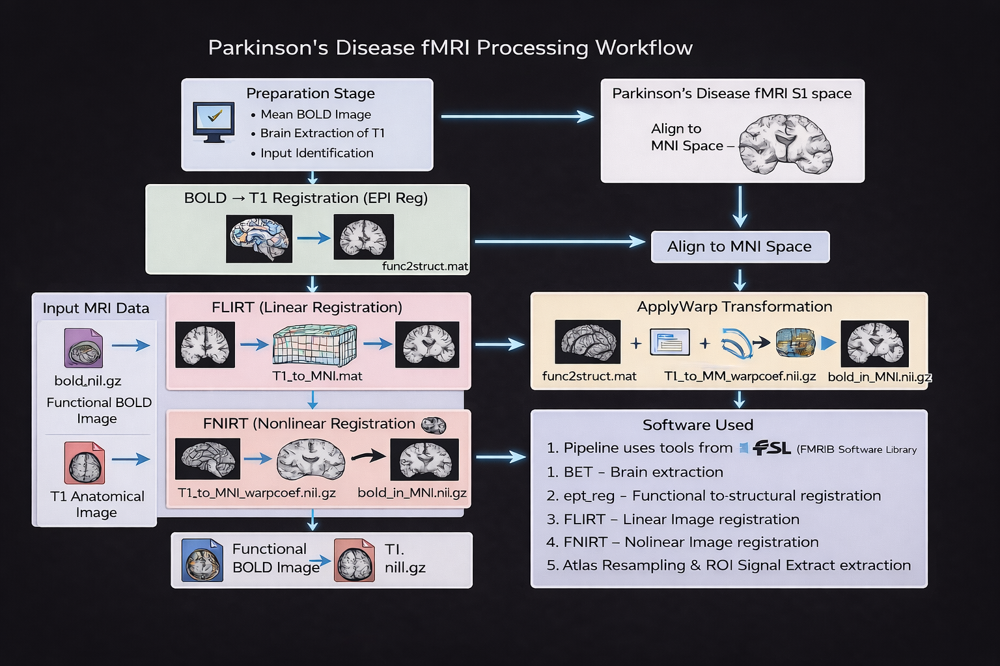

# Parkinson’s Disease fMRI Processing Workflow

This directory contains the **detailed documentation of the MRI image processing pipeline** used in the Parkinson’s Disease fMRI project. The pipeline explains how functional MRI (BOLD) data are progressively transformed and aligned with the **MNI standard brain space** to enable reliable **region-of-interest (ROI) signal extraction**.

The workflow is documented step-by-step, where each stage of the processing pipeline is explained in a separate document.

---

# Processing Pipeline

The overall MRI processing pipeline used in this project is illustrated below.

*Figure: Overview of the Parkinson’s fMRI processing pipeline showing the transformation from BOLD space to MNI standard space.*

---

## Pipeline Overview

The complete processing pipeline consists of the following stages:

1. Preparation Stage  
2. BOLD to T1 Registration (EPI Registration)  
3. FLIRT Linear Registration  
4. FNIRT Nonlinear Registration  
5. ApplyWarp Transformation  
6. Atlas Resampling and ROI Signal Extraction  

The goal of this pipeline is to transform functional MRI data from **native subject space to MNI standard space** while preserving anatomical accuracy.

---

## Documentation Files

### 1. Pipeline Overview
`1. Parkinsons_fMRI_Pipeline_Overview.docx`

Provides a general overview of the Parkinson’s fMRI processing workflow and the motivation behind the pipeline.

---

### 2. Preparation Stage
`2. Preparation Stage.docx`

Explains the preprocessing steps performed before registration, including:

- Identification of input MRI modalities  
- Generation of the mean BOLD image  
- Brain extraction of the T1 anatomical image  

These steps prepare the data for the EPI registration stage.

---

### 3. BOLD to T1 Registration
`3. BOLD to T1 Registration Documentation.docx`

Describes the **EPI registration process** where the functional BOLD image is aligned with the subject’s anatomical T1 image using **FSL's `epi_reg` tool**.

This stage produces the transformation matrix:

func2struct.mat

which maps **BOLD space → T1 space**.

---

### 4. FLIRT Registration Stage
`4. FLIRT Registration Stage.docx`

Explains the **linear registration** of the subject’s anatomical brain to the **MNI standard template** using **FLIRT (FMRIB’s Linear Image Registration Tool)**.

Output transformation matrix:

T1_to_MNI.mat

---

### 5. FNIRT Explanation (1D Example)
`5. Explanation of FNIRT with 1D Example.docx`

Introduces the concept of **nonlinear registration** using a simplified **1D example** to explain how control points generate smooth deformation fields.

---

### 6. FNIRT Explanation (3D Example)
`6. Explanation of FNIRT with 3D Example.docx`

Extends the nonlinear registration concept to **real 3D neuroimaging data**, explaining how FNIRT computes deformation fields to align the subject’s anatomical brain with the MNI template.

Output file:
T1_to_MNI_warpcoef.nii.gz

---

### 7. ApplyWarp Process
`7. Explanation of the applywarp Process for BOLD Data.docx`

Describes how the final transformation is applied to the functional BOLD image using **FSL’s `applywarp` tool**.

This step combines:
#BOLD → T1 transformation
#T1 → MNI nonlinear warp

to generate:

bold_in_MNI.nii.gz

---

## Software Used

The pipeline uses tools from the **FSL (FMRIB Software Library)** neuroimaging toolkit.

Main tools used:

- BET – Brain extraction  
- epi_reg – Functional to structural registration  
- FLIRT – Linear image registration  
- FNIRT – Nonlinear image registration  
- applywarp – Applying spatial transformations  

---
